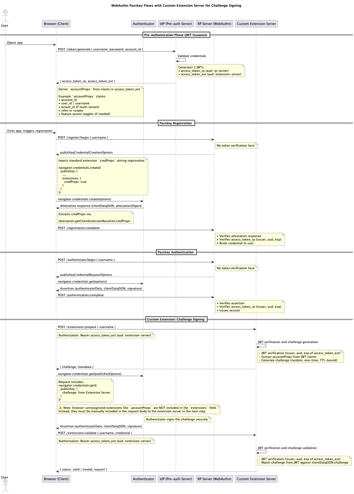

# Overview: WebAuthn Passkey POC with Custom Extension Server

This proof-of-concept demonstrates how to extend the WebAuthn passkey-based registration and authentication flow with a
secure client-to-extension-server interaction — **without misusing the `extensions` mechanism** and fully aligned with
FIDO2/WebAuthn specifications.

---

## 🎯 Goal

Build a fully working, standards-compliant **passkey-based authentication** system that:

- Uses **stateless JWT-based challenges** to simplify validation and avoid server-side storage
- Stores credentials in **in-memory structures**, with no persistent database
- Supports **real or virtual authenticators** (e.g., Chrome DevTools, YubiKey)
- Separates concerns cleanly across:
    - **Identity Provider** (JWT issuance)
    - **Relying Party (RP) Server** (WebAuthn registration/authentication)
    - **Extension Server** (custom domain logic)
- Demonstrates a secure client → extension-server interaction using WebAuthn ceremony
- Injects **custom business context** (`accountProps`) outside of the WebAuthn API — without misusing `extensions`
- Adheres strictly to **FIDO2/WebAuthn standards** and avoids assumptions unsupported by browser APIs

---

## 🧩 Architectural Principles

- **Stateless by Design**: No server-side storage — challenges are JWT-based and self-contained
- **Extension-Oriented**: Supports both **standard extensions** (e.g., `credProps`) and **custom extensions** (
  `accountProps`)
- **Modular and Realistic**: Each responsibility is cleanly split across the Client, RP, Identity Provider, and
  Extension Server — mirroring production-level design

---

## 🧱 System Components

### 1. Web Client (Vanilla JS + Vite)

- Form-based UI for passkey registration & login
- Calls `navigator.credentials.create()` and `navigator.credentials.get()`
- Sends attestation/assertion to RP server
- Uses `/extensions/prepare` to get challenge and injects it in a second WebAuthn call
- Logs `credProps` (standard extension) to show browser-recognized behavior
- Sends out-of-band `accountProps` to extension server during validation

### 2. Relying Party Server (FastAPI)

- Endpoints:
    - `POST /register/begin` → Generates challenge and publicKeyCredentialCreationOptions
    - `POST /register/complete` → Verifies attestation
    - `POST /authenticate/begin` → Generates challenge and publicKeyCredentialRequestOptions
    - `POST /authenticate/complete` → Verifies assertion and returns session
- JWTs validated on each call using audience (`rp-server`)
- Validates attestation and assertion using FIDO2 libraries

### 3. Extension Server (FastAPI Stub)

- Endpoints:
    - `POST /extensions/prepare` → Validates JWT and generates a challenge (nonce)
    - `POST /extensions/validate` → Verifies challenge signature and `accountProps` (JWT)
- Uses credential ID to fetch public key
- Performs secure origin and challenge validation

### 4. Identity Provider (FastAPI Stub)

- Endpoint: `POST /token/generate`
- Authenticates the user based on `username/password`
- Issues runtime-scoped JWTs for:
    - RP Server (`aud: rp-server`)
    - Extension Server (`aud: extension-server`)

---

## 🔐 Trust Model

- JWTs are short-lived, audience-scoped, and cryptographically signed.
- Custom business context (`accountProps`) is derived securely by the client and submitted manually to the extension
  server.

---

## 🧾 Flow Summary

### 1. Pre-authentication (JWT Issuance)

- Browser authenticates with `IdP` using credentials (username, password).
- IdP issues two JWTs:
    - `access_token_rp` → `aud: rp-server`
    - `access_token_ext` → `aud: extension-server`

### 2. Passkey Registration

- Client calls `POST /register/begin` to RP Server with RP token
- RP returns `publicKeyCredentialCreationOptions`
- Browser invokes `navigator.credentials.create(...)`
- Authenticator returns attestation (clientDataJSON, attestationObject)
- Client calls `POST /registration/complete`

### 3. Passkey Authentication

- Client calls `POST /authenticate/begin` to RP Server with RP token
- RP returns `publicKeyCredentialRequestOptions`
- Browser invokes `navigator.credentials.get(...)`
- Authenticator signs challenge
- Client calls `POST /authentication/complete`

### 4. /extensions/prepare

- Client calls `POST /extensions/prepare` with `access_token_ext`
- Server returns challenge (short-lived, nonce-bound)
- Client may also fetch or derive `accountProps` (JWT)

### 5. navigator.credentials.get (Challenge Signing)

- Second WebAuthn call with challenge from extension server
- Browser calls `navigator.credentials.get({ publicKey: { challenge, allowCredentials }})`
- Authenticator signs challenge

### 6. /extensions/validate

- Client sends signed challenge to `/extensions/validate` with:
    - `authenticatorData`, `clientDataJSON`, `signature`
    - `credentialId`
    - `accountProps` (JWT)
- Server verifies:
    - JWT (issuer, audience, expiry)
    - Challenge vs clientDataJSON.challenge
    - Origin
    - Signature

---

## ✅ Why Use JWTs for Challenge and Extensions?

- **Challenge JWT**: Encapsulates challenge metadata securely and verifiably
- **Account JWT**: Injected by client manually into validation step
    - Represents domain-specific user context (e.g., accountId, tenantId, scopes)
    - Avoids misuse of WebAuthn extension interface
- **Extension Server**: Independently validates everything without affecting RP

---

## 🚫 Why Not Use clientExtensionResults?

- `accountProps` is **not a browser-recognized extension**
- WebAuthn ignores unrecognized keys in extensions object
- They are neither sent to authenticator nor echoed back to client
- Instead: pass them manually via secure, client-controlled POST

---

## 🧪 Security Notes

- Do not trust unsigned or unverified claims (`accountProps`)
- Validate all tokens (audience, issuer, expiry)
- Always compare challenge from JWT with `clientDataJSON.challenge`
- Always verify origin from `clientDataJSON.origin`

---

## 📎 Optional Enhancements (Future Work)

- Add challenge replay protection (store nonce hash server-side)
- Support token refresh flow for long-lived sessions
- Add rate limiting or IP-bound tokens for extension flows
- Add UI visibility into step-by-step flows